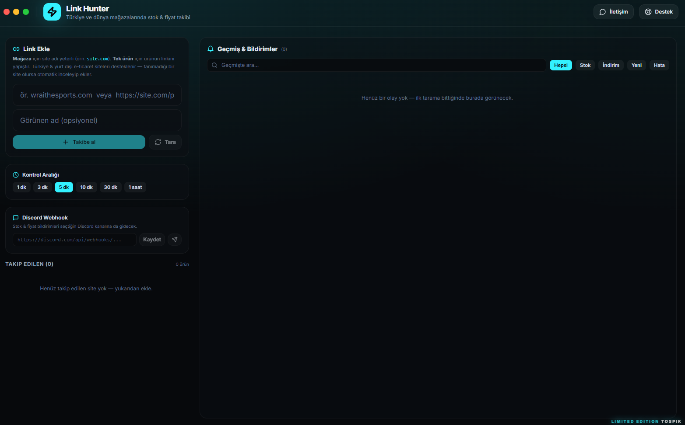

# Link Hunter

**Türkiye ve dünya e-ticaret sitelerinde stok & fiyat takibi**
Masaüstü bildirimleri + Discord webhook entegrasyonu.



---

## Bu klasörde ne var?

| Dosya | Açıklama |
|---|---|
| `LinkHunter-Setup.zip` | Windows installer (çalıştırılabilir setup.exe'yi içerir) — 99 MB |
| `README.md` | Bu dosya |

---

## Kurulum

1. **`LinkHunter-Setup.zip`** dosyasını çıkart
2. İçinden çıkan **`LinkHunter-Setup-LIMITED-EDITION-TOSPIK.exe`** dosyasına çift tıkla
3. Kurulum sihirbazı açılınca **"İleri"** → kurulum yolunu seç (varsayılan önerilir) → **"Kur"**
4. Masaüstü kısayolu ile veya Start Menu'den **Link Hunter**'ı başlat

Kurulum yapılacaklar:
- Program Files altına uygulama dosyaları
- Masaüstüne "Link Hunter" kısayolu
- Start Menu'de "Link Hunter" girişi
- Uninstaller (Denetim Masası > Program Ekle/Kaldır)

---

## Nasıl çalışır? (Genel mantık)

Link Hunter, verdiğin e-ticaret linkini **belirli aralıklarla tekrar ziyaret eder**, her ziyarette ürünün **stok durumu, fiyatı ve varyantlarını** kaydeder, önceki kayıtla karşılaştırır. Değişiklik olduğunda seni anında uyarır.

**Desteklenen iki mod:**

### 🏬 Mağaza modu (tüm site)
- **Sadece Shopify tabanlı sitelerde** çalışır (çünkü sadece Shopify herkese açık `/products.json` endpoint'i sunar)
- Örnek: `https://wraithesports.com` yaz → **binlerce ürün** tek seferde taranır
- Yeni eklenen ürünler, restock, fiyat değişimleri otomatik takip edilir

### 📦 Ürün modu (tek link)
- **Neredeyse her siteyi** destekler — Hepsiburada, Trendyol, N11, Amazon, Zara, MediaMarkt, Vatan, vb.
- Örnek: `https://www.hepsiburada.com/apple-iphone-15-128-gb-p-HBC00005JI7Q1` → sadece bu ürün takip edilir
- Önce Shopify endpoint'i denenir; bulunamazsa ürün sayfasındaki **JSON-LD Product şeması** (SEO için tüm büyük siteler sunar) ve OpenGraph meta tag'leri ile stok + fiyat çıkarılır

---

## İlk kullanım (5 dakikada)

### 1. Link ekle
- Programı aç → ana ekranda sol üstteki **"Link Ekle"** kartına git
- Bir link yapıştır:
  - Mağaza için: `site.com` (sadece domain yeterli)
  - Ürün için: `https://site.com/urun-ismi-p-12345`
- Program otomatik olarak **Mağaza / Ürün** moduna karar verir ve platformu tespit eder (Shopify / Genel)

### 2. Ne bekliyorsun?
Link ekleme formunda 3 butonlu pill seçici çıkar:

| Mod | Açıklama |
|---|---|
| **Stok** | Sadece stoka girince bildir (fiyat değişimlerini görmezden gel) |
| **İndirim** | Sadece fiyat düşünce bildir |
| **Hepsi** | Stok + fiyat + yeni ürün — varsayılan |

Seçeneği sonradan da değiştirebilirsin (her sitenin kartında pill'ler var).

### 3. Takibe al
- **"+ Takibe al"** butonuna bas → link listelenir, ilk tarama otomatik başlar
- Baseline oluşur (ilk tarama bildirim göndermez, sadece mevcut durumu kaydeder)

### 4. Kontrol aralığı
Sol paneldeki **"Kontrol Aralığı"** kartından poll frekansını seç:
- `1 dk` / `3 dk` / `5 dk` (varsayılan) / `10 dk` / `30 dk` / `1 saat`

### 5. Discord webhook (opsiyonel ama önerilir)

> ℹ️ **Webhook alanı her yeni kurulumda tamamen boştur** — senin kendi Discord sunucun/kanalın için ayarlaman gerek. Hiçbir webhook URL'i uygulamaya gömülü değildir.

**Nasıl webhook oluşturulur:**
1. Discord sunucunda → Kanal ayarları (⚙️) → **Integrations** → **Webhooks** → **New Webhook**
2. İstersen isim ver (Link Hunter otomatik değiştirecek), kanal seç → **Copy Webhook URL**
3. Kopyaladığın URL'i Program'daki **"Discord Webhook"** kartına yapıştır → **Kaydet**
4. **Test** (✈️) butonu ile dene — "✅ Bağlantı testi başarılı" yeşil yazısı gelirse hazırsın
5. Test başarılı olunca webhook'un avatar'ı otomatik olarak **Link Hunter cyan logosu**, ismi **Link Hunter** olur (Discord'da 1-2 dakika gecikmeli güncellenebilir)
6. Bundan sonra her stok girişi, fiyat düşüşü, yeni ürün olayında seçtiğin Discord kanalına **zengin embed mesajı** düşer

Webhook URL'i sadece senin makinendeki `AppData\Roaming\Link Hunter\link-hunter-tracker.json` dosyasında saklanır, başka kimse göremez.

---

## Bildirimler neyi, ne zaman gönderir?

Aşağıdaki olaylar **hem masaüstü bildirimi hem Discord'a** gönderilir (watch modu filtresine göre):

| Olay | Anlamı | Masaüstü | Discord |
|---|---|:---:|:---:|
| 📦 **Stokta** | Bir varyant stok dışıyken stoka girdi | ✅ | ✅ cyan |
| 💸 **Fiyat düştü** | Bir varyantın fiyatı öncekinden daha düşük | ✅ | ✅ yeşil |
| 🆕 **Yeni ürün** | Mağazaya hiç olmayan ürün eklendi (sadece mağaza modu) | ✅ | ✅ cyan |
| ⛔ Tükendi | Stokta olan bir varyant tükendi | ❌ | ❌ (sadece geçmişe kaydedilir) |
| 📈 Fiyat arttı | Fiyat öncekinden yüksek | ❌ | ❌ (geçmişe kaydedilir) |
| ❗ Hata | Siteye erişilemedi, yanıt geçersiz vb. | ❌ | ❌ (geçmişe kaydedilir, aynı hata arka arkaya yinelenmez) |

---

## Ana arayüz bileşenleri

### Sol panel
- **Link Ekle formu** — URL + isim + watch modu + ekle/tara butonları
- **Kontrol Aralığı** — poll frekansı
- **Discord Webhook** — URL + Kaydet + Test
- **Takip Edilen (N)** — aktif linkler listesi. Her kart şunları içerir:
  - Ürün görseli / logo
  - **Mağaza** veya **Ürün** rozeti
  - Platform (Shopify / Genel)
  - Ürün/varyant/stokta sayısı, son tarama zamanı
  - **Bekleyen** pill'leri (Stok / İndirim / Hepsi) — tıklanarak değiştirilir
  - Aksiyon butonları: 🔄 şimdi tara · ⏻ duraklat (yeşil=aktif, kırmızı=pasif) · 🔗 siteye git · 🗑️ kaldır (kırmızı)

### Sağ panel
- **Geçmiş & Bildirimler** — son 500 olay
- Arama kutusu (ürün adı, site, mesaj içinde arar)
- Tür filtresi: Hepsi / Stok / İndirim / Yeni / Hata
- **Temizle** butonu — tüm geçmişi siler (hem UI hem kalıcı kayıt)
- Her olaya tıklayınca ilgili ürün sayfası dış tarayıcıda açılır

---

## Arka plan & sistem tepsisi

- Ana pencereyi X'e bastığında program **kapanmaz**, sistem tepsisine (sağ alt sağ tık) iner
- Tray menüsü:
  - **Link Hunter — N link takipte** (bilgi)
  - **Göster** — pencereyi geri getirir
  - **Pencereyi gizle**
  - **Çıkış (Link Hunter'ı durdur)** — tamamen kapatır, poller durur
- PC kapanana veya "Çıkış" seçene kadar **poller arka planda çalışmaya devam eder** — pencere görünmese bile bildirimler gelir

---

## Veri nerede saklanır?

Tüm konfigürasyon + olay geçmişi Windows kullanıcı dizininde:

```
C:\Users\<kullanıcı>\AppData\Roaming\Link Hunter\link-hunter-tracker.json
```

İçerik: takip edilen siteler, ürün snapshot'ları, olay geçmişi, Discord webhook URL, poll aralığı.

Sıfırlamak istersen: program kapalıyken bu dosyayı sil.

---

## Desteklenen siteler — örnekler

### Shopify (mağaza modu çalışır)
- wraithesports.com, gymshark.com, allbirds.com, kith.com, fashionnova.com
- Türkiye'deki Shopify sitesi hangisiyse — `site.com/products.json` açıyorsa destekleniyor

### Ürün modu (JSON-LD / OpenGraph üzerinden)
**Türkiye:**
- Hepsiburada, Trendyol, N11, GittiGidiyor, Çiçeksepeti
- MediaMarkt, Vatan, Teknosa
- Decathlon TR, Defacto, Koton, LC Waikiki (JSON-LD varsa)

**Yurt dışı:**
- Amazon (tüm bölgeler), eBay, Zara, H&M, Nike, Adidas
- BestBuy, Newegg, Target, Walmart
- AliExpress (sınırlı — lazy-load JS)

**Prensip:** Site modern SEO için `schema.org/Product` JSON-LD koyuyorsa → çalışır. Modern sitelerin %95'i koyuyor.

---

## Sınırlamalar

- **Mağaza modu sadece Shopify'da** — Trendyol gibi siteler için halka açık "tüm ürünleri listele" API'si yok, o yüzden tek tek ürün linki eklemen gerek
- **Ağır JS-render'lı siteler** bazı ürün sayfaları için JSON-LD'yi client-side yüklediğinde bizim statik HTML fetch'imiz göremeyebilir (headless browser olmadan). Bu durumda hata kaydı oluşur
- **Site rate-limit** uygularsa (çok sık istek) → geçici hata; kontrol aralığını uzat

---

## Sorun giderme

**"Bu site mağaza modunu desteklemiyor" hatası alıyorum**
→ Shopify değil. Takip etmek istediğin ürünün linkini (ürün sayfası URL'i) yapıştır, tüm site yerine.

**Discord'a mesaj gelmiyor**
→ Webhook URL'i **Kaydet** butonuna bastığından emin ol, sonra **Test** ile dene. Test başarılı olmuyorsa webhook URL'i yanlış veya kanal silinmiş olabilir.

**Discord'da avatar hala wumpus (varsayılan) görünüyor**
→ Webhook kartında **Test** (✈️) butonuna tek kez bas — mevcut webhook'un avatar'ı cyan logomuzla güncellenir. Discord cache'i nedeniyle avatar güncelleme 1-2 dakika gecikmeli görünebilir.

**Hiç bildirim gelmiyor**
→ İlk taramada baseline oluşur, bildirim gitmez — ikinci taramadan itibaren değişim tespit edilir. `1 dk` aralık seçip test için farklı fiyatlı / stok durumlu bir ürün eklemeyi dene.

**Tray'de çıkış yaptığımda arka planda çalışmaya devam ediyor mu?**
→ Hayır. Tray menüsünde **"Çıkış (Link Hunter'ı durdur)"** dersen tamamen kapanır. Sadece X'e basarsan tray'de kalır ve çalışmaya devam eder.

---

## Gizlilik

- **Hiçbir veri dışarı gönderilmez** — Discord webhook dışında (sadece senin ayarladığın URL'e)
- Tüm kayıtlar **lokal** tutulur (`AppData\Roaming\Link Hunter\`)
- Uygulama **herhangi bir analytics / telemetri** içermez

---

## Sürüm

**1.0.0 — LIMITED EDITION TOSPİK**
- Windows x64
- Electron 33 tabanlı
- ASAR integrity + Electron Fuses güvenlik kilitleri etkin
- Installer imzasız (Windows SmartScreen uyarısı geldiğinde "Diğer seçenekler > Yine de çalıştır" seçmen gerekebilir)

---

*© 2026 TOSPİK — Limited Edition*
